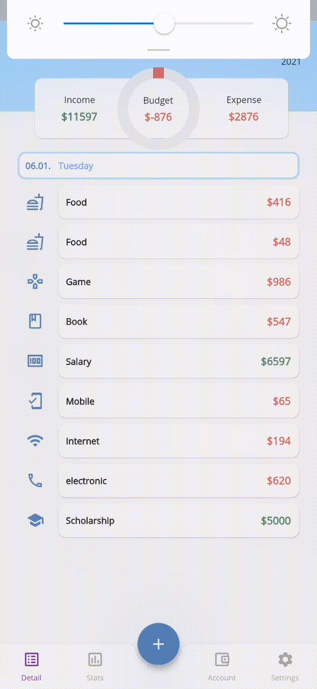

# Financy

Financy is a money management application using Flutter framework. 

## Screenshots

### Home page

- list all transactions of given month
- modify budget amount (limit of expense of given month)

### Transactions

- manage transactions (add, modify, delete)
- transaction parameters: income or expense or transfer, catogry, amount, account, date, comment, location, member (this transaction belongs to, from contact list), picture about recipe
- inline calculator

### Accounts page

- manage accounts (add, modify delete)

### Stats page

- view monthly income and expense by catogories

### Settings page

- change language (English, Simplified Chinese)
- manage categories (add, delete, modify)

## References

- [circle tab indicator](https://medium.com/swlh/flutter-custom-tab-indicator-for-tabbar-d72bbc6c9d0c)